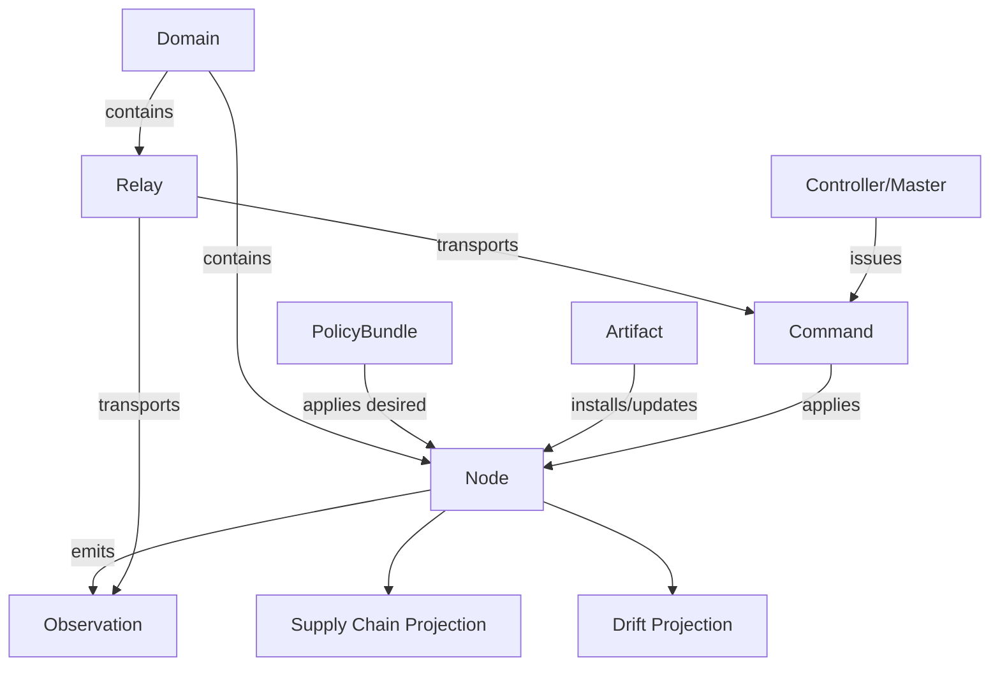
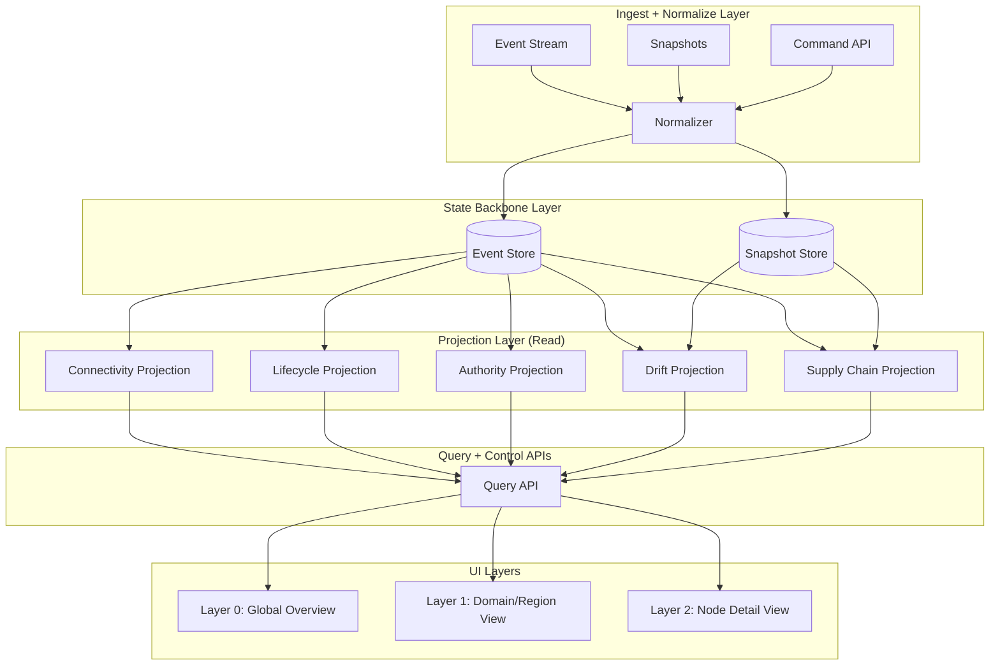
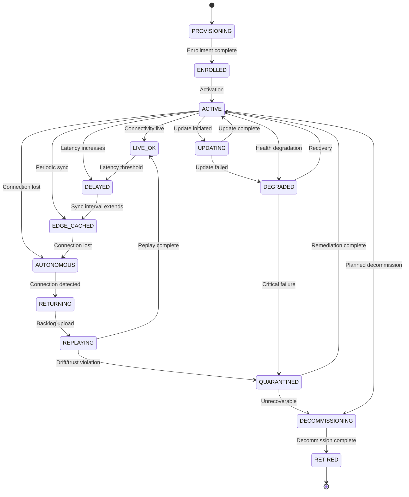
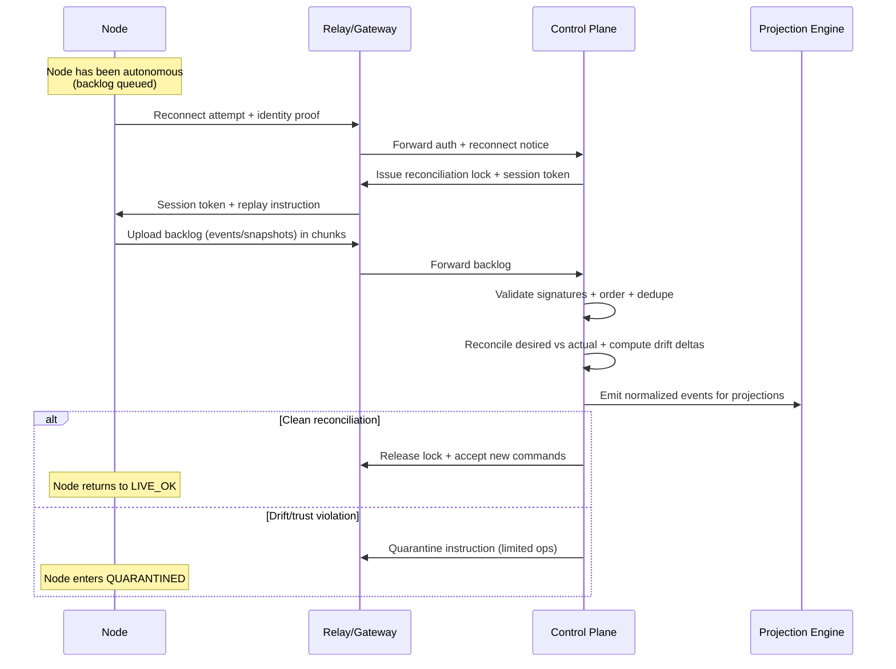

# IBCF Fleet Monitoring + Lifecycle Core Design (v0)

This document defines:
1) Canonical Fleet Object Model (schema-level)
2) UI layering model (global / region / edge) and the projections to render it cleanly
3) Node lifecycle state machine (including autonomous + return replay)

---

## 1) Canonical IBCF Fleet Object Model (Schema-Level)

### Design goals
- Stable identity, even when connectivity is absent
- Represent *desired vs actual*, drift, and authority boundaries
- Support multi-master control planes (regional autonomy) and eventual consistency
- Support supply-chain / provenance tracking as first-class
- Support store-and-forward + replay workflows

### Canonical objects
- **Node**: physical/virtual compute element (edge node, DC node, gateway, appliance)
- **Relay**: comm/control intermediaries (brokers, gateways, sat links, store-and-forward hops)
- **Domain**: trust/authority scope (region, cluster, tenant, air-gap island, etc.)
- **PolicyBundle**: desired-state definition (config + version + constraints)
- **Observation**: telemetry event or snapshot
- **Command**: control intent with delivery semantics (at-most-once / at-least-once)
- **Artifact**: signed software/firmware payload (SBOM + provenance)
- **Timeline**: lifecycle phases and transitions for the node

### Minimal JSON-style schema (v0)
> Treat as a conceptual schema; implement as Go structs + protobuf later.

```json
{
  "Node": {
    "id": "uuid/ulid",
    "name": "string",
    "kind": "EDGE|DC|GATEWAY|RELAY|VIRTUAL",
    "tags": ["string"],
    "domain_id": "uuid/ulid",
    "authority": {
      "master_of_record": "GLOBAL|REGION|LOCAL",
      "controller_ids": ["string"],
      "last_authoritative_update_ts": "rfc3339"
    },

    "connectivity": {
      "mode": "LIVE|DELAYED|EDGE_CACHED|AUTONOMOUS|DISCONNECTED|RETURNING|REPLAYING",
      "last_seen_ts": "rfc3339",
      "link_quality": {
        "rtt_ms": 0,
        "loss_pct": 0,
        "bandwidth_kbps": 0
      },
      "sync_debt": {
        "seconds_behind": 0,
        "backlog_messages": 0,
        "replay_required": false
      }
    },

    "desired_state": {
      "policy_bundle_id": "uuid/ulid",
      "target_version": "semver/string",
      "constraints": {
        "maintenance_window": "string",
        "requires_online": false,
        "min_battery_pct": 0
      }
    },

    "actual_state": {
      "reported_version": "semver/string",
      "runtime": {
        "health": "OK|DEGRADED|FAILED|UNKNOWN",
        "last_heartbeat_ts": "rfc3339",
        "uptime_s": 0
      },
      "inventory": {
        "cpu": "string",
        "ram_gb": 0,
        "storage_gb": 0,
        "gpus": ["string"]
      }
    },

    "drift": {
      "score": 0.0,
      "objects_out_of_spec": 0,
      "details_ref": "uri/string",
      "last_evaluated_ts": "rfc3339"
    },

    "supply_chain": {
      "hardware": {
        "serial": "string",
        "manufacturer": "string",
        "model": "string",
        "bom_ref": "uri/string"
      },
      "firmware": {
        "version": "string",
        "signature": "string",
        "provenance_ref": "uri/string"
      },
      "software": {
        "artifact_id": "uuid/ulid",
        "sbom_ref": "uri/string",
        "attestations": ["uri/string"],
        "signature": "string"
      }
    },

    "lifecycle": {
      "phase": "PROVISIONING|ENROLLED|ACTIVE|UPDATING|DEGRADED|QUARANTINED|DECOMMISSIONING|RETIRED",
      "state": "string (state machine)",
      "last_transition_ts": "rfc3339",
      "reason": "string"
    },

    "observations": {
      "last_snapshot_ref": "uri/string",
      "last_event_ref": "uri/string"
    }
  }
}
```

### Key invariants (non-negotiable)

- **Node.id is immutable** across all lifetimes.
- **Authority must be explicit**: who is allowed to declare "desired" for this node right now.
- **Connectivity mode is a spectrum**, not binary.
- **Drift is a computed projection** (do not store drift as the primary truth; store inputs).

### 1A) Object relationship diagram (Mermaid)



---

## 2) UI Layering Model (Global / Region / Edge)

### UI goals

- "Simple, clean" at top level, but drill-down depth when needed
- Support massive scale (avoid rendering raw node lists as the primary UX)
- Make autonomy + replay visible without scaring operators
- Make authority boundaries visible (multi-master reality)

### UI layers

#### Layer 0: Global Fleet Overview (executive + SRE)

**Primary questions:**
- How many are live vs delayed vs autonomous vs replaying?
- Which domains are drifting the most?
- Where is the control plane authoritative vs degraded?

**Widgets:**
- Connectivity spectrum distribution
- Drift heat map by domain
- Upgrade rollout status by policy bundle
- "Attention queue" (top N critical anomalies)

#### Layer 1: Domain / Region / Cluster View (operator)

**Primary questions:**
- Which sub-fleets are behind?
- What relay paths are failing?
- Which policy bundles are safe to advance?

**Widgets:**
- Domain topology overlay (relays + edges)
- Sync-debt / backlog timeline
- Domain health summary + anomaly list
- Batch actions scoped by authority and constraints

#### Layer 2: Node Detail View (engineering)

**Primary questions:**
- What is desired vs actual, exactly?
- What drift objects differ?
- What's the replay status and last known good snapshot?
- Is this node trusted and supply-chain clean?

**Widgets:**
- Desired vs actual diff view (structured)
- Lifecycle timeline (state transitions)
- Replay progress + backlog
- Supply-chain panel (SBOM / signatures / provenance)
- Observations timeline (events / snapshots)

### Critical UI technique: projections (not raw metrics)

The UI should render projections from an event store:

- **ConnectivityProjection**
- **DriftProjection**
- **AuthorityProjection**
- **LifecycleProjection**
- **SupplyChainProjection**

Each projection is queryable by:
- `domain_id`
- `tags`
- `policy_bundle_id`
- `time window`

### 2A) UI layering architecture diagram (Mermaid)



### 2B) Operator "attention queue" model (practical)

A scalable UI needs an inbox. Example attention scoring inputs:

- Drift score
- Sync debt (seconds behind + backlog)
- Authority mismatch (who thinks they're master)
- Health degradation (OK → DEGRADED)
- Supply chain violation (signature missing)

**Output**: top N items per domain + global top N.

---

## 3) Node Lifecycle State Machine (Autonomous + Return Replay)

### Lifecycle phases vs states

- **Phase** is coarse (PROVISIONING, ACTIVE, etc.)
- **State** is precise (LIVE_OK, AUTONOMOUS_BUFFERING, REPLAYING_APPLYING, …)

### Core connectivity states (spectrum)

```
LIVE → DELAYED → EDGE_CACHED → AUTONOMOUS → DISCONNECTED → RETURNING → REPLAYING → LIVE
```

### Key behaviors

- **In AUTONOMOUS**: node continues local policies; records observations + local decisions
- **In RETURNING**: node re-establishes a control channel; does not immediately accept new commands until reconciliation
- **In REPLAYING**: node uploads backlog; control plane applies reconciliation policy
- **After REPLAYING**: node becomes LIVE or QUARANTINED depending on trust/drift results

### 3A) Lifecycle state diagram (Mermaid State Diagram)



### 3B) Return + Replay sequence (Mermaid Sequence Diagram)



---

## Implementation notes (non-rabbit-hole, but important)

- Keep the event store **append-only**; projections are rebuildable.
- Commands require delivery semantics (at-least-once + idempotency keys).
- **AuthorityProjection** prevents split-brain in multi-master (UI must show it).
- Drift is computed from snapshots + desired bundles, not raw metrics.

---

## Appendix: Mermaid support in Markdown

Mermaid supports:

- **flowcharts**: `flowchart LR|TB`
- **state machines**: `stateDiagram-v2`
- **sequence diagrams**: `sequenceDiagram`
- **gantt timelines**: `gantt` (useful for rollout timelines)

All Mermaid diagrams render directly in MkDocs Material when using the `pymdownx.superfences` extension with Mermaid support.

---

## Next Steps

1. Implement Go structs matching the canonical schema
2. Build event store foundation
3. Create projection engine
4. Design UI mockups for each layer
5. Implement state machine engine
6. Build reconciliation logic
