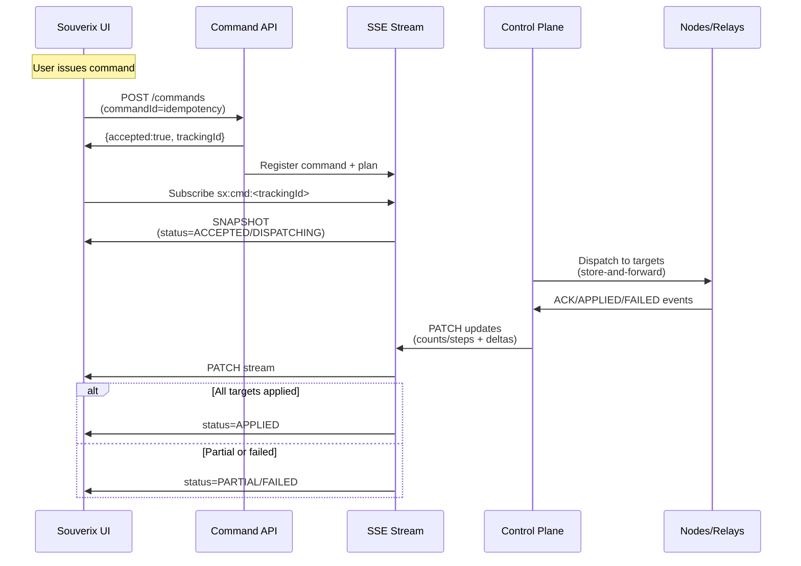

# Souverix Platform UI — Practical Add-ons (v0)

This document adds 3 concrete pieces to the Platform UI Architecture:

1. **The topic list** we'll actually ship (SSE topics + payload expectations)
2. **The minimal NodeCardVM split**: "domain table rows" vs "node detail"
3. **The command tracking UI flow**: accepted → in-flight → applied → failed (incl. SSE events + UI states)

**Scope:** Product-wide (Souverix shell + modules). IBCF is just one module consumer.

---

## 1) Topic List to Actually Ship (SSE)

### 1.1 Topic Naming Convention

Use namespaces:
- `sx:` = Souverix core substrate topics (shared by all modules)
- `mod:<name>:` = module topics (ibcf, lcm, sc, policy, registry, etc.)

**Topic Pattern:**
- Global: `sx:global`
- Domain-scoped: `sx:domain:<domainId>`
- Node-scoped: `sx:node:<nodeId>`
- Command-scoped: `sx:cmd:<trackingId>`

**Module Examples:**
- `mod:ibcf:domain:<domainId>`
- `mod:lcm:node:<nodeId>`
- `mod:sc:node:<nodeId>`

### 1.2 Minimum Core Topics (Ship These First)

These four are the "fleet substrate" and map directly to your UI layers:

#### A) Connectivity

- `sx:global/connectivity`
- `sx:domain:<domainId>/connectivity`
- `sx:node:<nodeId>/connectivity`

**Purpose:**
- Connectivity spectrum mode
- lastSeen
- link quality (optional)
- sync debt/backlog + replay progress (high value)

#### B) Lifecycle

- `sx:global/lifecycle`
- `sx:domain:<domainId>/lifecycle`
- `sx:node:<nodeId>/lifecycle`

**Purpose:**
- phase/state transitions
- reason codes
- lock-outs for command UI (e.g., REPLAYING, QUARANTINED)

#### C) Drift

- `sx:global/drift`
- `sx:domain:<domainId>/drift`
- `sx:node:<nodeId>/drift`

**Purpose:**
- drift score + objects out-of-spec
- last evaluated ts
- optional "top drift paths" list for attention queue

#### D) Authority

- `sx:global/authority`
- `sx:domain:<domainId>/authority`
- `sx:node:<nodeId>/authority`

**Purpose:**
- master-of-record visibility
- conflict detection (split-brain risk)
- permission gating for commands ("who is allowed to act")

### 1.3 "Attention Queue" Topic (Strongly Recommended)

- `sx:global/attention`
- `sx:domain:<domainId>/attention`

**Purpose:**
- Scalable UI = "inbox of work"
- Prevents operators from hunting through 50k nodes

### 1.4 Command Tracking Topics (Required for Clean UX)

- `sx:cmd:<trackingId>`

**Purpose:**
- Command status progression
- Per-step results
- Correlation to targets (nodeIds/domainId/tags)

### 1.5 Event Envelope (SSE)

All topics use one envelope:

```typescript
interface SSEEnvelope {
  eventId: string;        // ULID
  ts: string;            // RFC3339
  topic: string;         // e.g., "sx:domain:abc/connectivity"
  type: "SNAPSHOT" | "PATCH" | "TOMBSTONE" | "HEARTBEAT";
  projection: "CONNECTIVITY" | "LIFECYCLE" | "DRIFT" | "AUTHORITY" | "ATTENTION" | "COMMAND";
  revision: number;
  payload: unknown;
}
```

**SSE Frame Mapping:**
- `id:` = eventId
- `event:` = type (SNAPSHOT/PATCH/...)
- `data:` = JSON envelope

### 1.6 Minimum Payload Fields (Don't Overthink v0)

#### CONNECTIVITY Payload

```typescript
interface ConnectivityPayload {
  entity: "node" | "domain" | "global";
  entityId: string;
  mode: "LIVE" | "DELAYED" | "EDGE_CACHED" | "AUTONOMOUS" | "DISCONNECTED" | "RETURNING" | "REPLAYING";
  lastSeenTs: string;        // RFC3339
  syncDebtSeconds: number;
  backlogMessages: number;
  rttMs?: number;
  lossPct?: number;
}
```

#### LIFECYCLE Payload

```typescript
interface LifecyclePayload {
  entity: "node";
  entityId: string;
  phase: "PROVISIONING" | "ENROLLED" | "ACTIVE" | "UPDATING" | "DEGRADED" | "QUARANTINED" | "DECOMMISSIONING" | "RETIRED";
  state: string;              // e.g., "REPLAYING", "LIVE_OK"
  lastTransitionTs: string;   // RFC3339
  reason?: string;            // e.g., "reconnect_backlog_detected"
}
```

#### DRIFT Payload

```typescript
interface DriftPayload {
  entity: "node" | "domain" | "global";
  entityId: string;
  score: number;              // 0..1
  objectsOutOfSpec: number;
  lastEvaluatedTs: string;   // RFC3339
}
```

#### AUTHORITY Payload

```typescript
interface AuthorityPayload {
  entity: "node" | "domain" | "global";
  entityId: string;
  masterOfRecord: "GLOBAL" | "REGION" | "LOCAL";
  controllerIds: string[];
  authorityMismatch: boolean;
  lastAuthoritativeUpdateTs: string;  // RFC3339
}
```

#### ATTENTION Payload

```typescript
interface AttentionPayload {
  entity: "global" | "domain";
  entityId?: string;         // domainId if domain-scoped
  items: Array<{
    itemId: string;
    severity: "P0" | "P1" | "P2";
    domainId: string;
    nodeId?: string;
    reason: string;
    ts: string;
  }>;
}
```

#### COMMAND Payload

See Section 3.4 for command tracking payloads.

---

## 2) Minimal NodeCardVM Split (Domain Rows vs Node Detail)

### 2.1 Why Split

At fleet scale you must separate:

**a) "row/card model"** for listing/virtualization (tiny, stable)

**b) "detail model"** for deep panels (bigger, on-demand)

**Rule:**
- Domain page streams RowVM patches
- Node detail page fetches DetailVM snapshot and streams Detail patches only while open

### 2.2 NodeRowVM (Domain Table Rows/Cards)

This is the hot path: keep it lean and patchable.

```typescript
// src/contracts/core/types.ts
export interface NodeRowVM {
  nodeId: string;
  name: string;
  kind: "EDGE" | "DC" | "GATEWAY" | "RELAY" | "VIRTUAL";
  domainId: string;

  // What operators need at-a-glance
  connectivityMode: "LIVE" | "DELAYED" | "EDGE_CACHED" | "AUTONOMOUS" | "DISCONNECTED" | "RETURNING" | "REPLAYING";
  lastSeenTs: string;

  health: "OK" | "DEGRADED" | "FAILED" | "UNKNOWN";

  // Drift summary only (no diffs)
  driftScore: number;              // 0..1
  outOfSpecCount: number;

  // Command gating
  masterOfRecord: "GLOBAL" | "REGION" | "LOCAL";
  authorityMismatch: boolean;

  // Operator flags (tiny booleans)
  quarantined: boolean;
  updateInProgress: boolean;
  supplyChainAlert: boolean;

  // Scale signals
  syncDebtSeconds: number;
  backlogMessages: number;
}
```

**Recommended UI Columns for Domain View:**

| Column | Data |
|--------|------|
| Name / Kind | `name`, `kind` |
| Connectivity | `connectivityMode` + `lastSeenTs` |
| Health | `health` |
| Drift | `driftScore` (badge) |
| Authority | `masterOfRecord` (badge) + `authorityMismatch` icon |
| Flags | `quarantined` / `updateInProgress` / `supplyChainAlert` |
| Sync Debt | `syncDebtSeconds` / `backlogMessages` (small) |

### 2.3 NodeDetailVM (Node Page)

Loaded on-demand. This is where you put diffs, timelines, supply chain details.

```typescript
// src/contracts/core/types.ts
export interface NodeDetailVM {
  generatedAtTs: string;

  // Embed the RowVM so detail always has the same header summary
  header: NodeRowVM;

  desired: {
    policyBundleId: string;
    targetVersion: string;
    constraints?: Record<string, unknown>;
  };

  actual: {
    reportedVersion: string;
    inventory?: Record<string, unknown>;
    runtime?: Record<string, unknown>;
  };

  desiredVsActual: Array<{
    path: string;         // e.g., "spec.runtime.foo"
    desired: unknown;
    actual: unknown;
    status: "MATCH" | "DIFF" | "MISSING";
  }>;

  lifecycleTimeline: Array<{
    ts: string;
    fromState: string;
    toState: string;
    reason?: string;
  }>;

  replay: {
    required: boolean;
    state: "NONE" | "LOCKED" | "UPLOADING" | "RECONCILING" | "DONE" | "FAILED";
    backlogMessages: number;
    percentComplete?: number;
    lastCheckpointTs?: string;
  };

  supplyChain: {
    hardwareSerial?: string;
    firmwareVersion?: string;
    artifactId?: string;
    sbomRef?: string;
    signatureOk?: boolean;
    attestations?: string[];
    violations?: Array<{ code: string; summary: string }>;
  };

  events: Array<{
    ts: string;
    type: string;
    summary: string;
    ref?: string;
  }>;
}
```

### 2.4 Patch Rules

- **RowVM patches** should be very frequent (connectivity/lifecycle/drift updates)
- **Detail patches** should be subscribed only when the node page is open:
  ```
  /stream?topics=sx:node:<id>/connectivity,sx:node:<id>/lifecycle,sx:node:<id>/drift,sx:node:<id>/authority,mod:sc:node:<id>
  ```

---

## 3) Command Tracking UI Flow (Accepted → In-Flight → Applied → Failed)

### 3.1 Why This Matters

Operators hate "clicked button, nothing happened".

You need a consistent command lifecycle with:
- Idempotency keys
- Tracking IDs
- Step-by-step statuses
- Correlation to nodes/domains/tags

### 3.2 Command Model (Server-Side Concept Exposed to UI)

**Command States:**
- `ACCEPTED` (server accepted intent)
- `DISPATCHING` (selecting targets / computing plan)
- `IN_FLIGHT` (delivering to relays/nodes)
- `APPLIED` (confirmed by nodes / reconciled)
- `FAILED` (permanent failure)
- `CANCELED` (optional)
- `PARTIAL` (some targets applied, some failed)

**Per-Target Status:**
- `PENDING`
- `SENT`
- `ACKED`
- `APPLIED`
- `FAILED`
- `SKIPPED` (constraints not met)
- `STALE` (node offline; will retry)

### 3.3 UI Flow

#### Step 0 — User Issues Command

- UI generates `commandId` (ULID) as idempotency key
- `POST` to `/commands` returns `{ accepted, trackingId }`

#### Step 1 — Immediate Feedback (Toast + Command Drawer)

If accepted:
- Open a "Command Drawer" (right-side panel)
- Show summary:
  - command type
  - target scope
  - trackingId
  - initial status `ACCEPTED`

#### Step 2 — Live Tracking via SSE

UI subscribes: `sx:cmd:<trackingId>`

Render:
- Progress bar (`percentComplete` if available)
- Counts: applied / failed / pending / skipped
- Per-target table (virtualized if huge)
- Errors grouped by reason

#### Step 3 — Terminal States

- `APPLIED`: show success + link to "rollout report"
- `FAILED`/`PARTIAL`: show reason clusters + "retry failed" button (new commandId)

### 3.4 Command SSE Topic + Payload

**Topic:**
```
sx:cmd:<trackingId>
```

**SNAPSHOT Payload:**

```typescript
interface CommandSnapshotPayload {
  trackingId: string;
  commandId: string;        // idempotency key
  type: "ROLL_OUT" | "QUARANTINE" | "CLEAR_QUARANTINE" | "RECONCILE" | "REBOOT" | "SET_POLICY";
  submittedTs: string;      // RFC3339
  status: "ACCEPTED" | "DISPATCHING" | "IN_FLIGHT" | "APPLIED" | "FAILED" | "CANCELED" | "PARTIAL";
  target: {
    domainId?: string;
    nodeId?: string;
    tags?: string[];
  };

  counts: {
    total: number;
    pending: number;
    sent: number;
    acked: number;
    applied: number;
    failed: number;
    skipped: number;
    stale: number;
  };

  steps: Array<{
    name: string;           // e.g., "plan", "dispatch", "verify"
    status: "PENDING" | "RUNNING" | "DONE" | "FAILED";
    ts?: string;
  }>;

  percentComplete?: number;  // 0..100
}
```

**PATCH Payload (JSON Patch or merge patch):**

```typescript
interface CommandPatchPayload {
  op: "patch";
  entity: "CommandStatus";
  entityId: string;        // trackingId
  patch: Array<{
    op: "replace" | "add" | "remove";
    path: string;
    value?: unknown;
  }>;
}

// Example patch:
{
  "op": "patch",
  "entity": "CommandStatus",
  "entityId": "trk-123",
  "patch": [
    { "op": "replace", "path": "/status", "value": "PARTIAL" },
    { "op": "replace", "path": "/counts/applied", "value": 733 },
    { "op": "replace", "path": "/counts/failed", "value": 12 }
  ]
}
```

**Optional Per-Target Delta Event (for huge fleets)**

Instead of sending the full target list, stream deltas as separate events on the same topic:

```typescript
interface CommandTargetDeltaPayload {
  op: "targetDelta";
  entityId: string;        // trackingId
  delta: Array<{
    nodeId: string;
    status: "PENDING" | "SENT" | "ACKED" | "APPLIED" | "FAILED" | "SKIPPED" | "STALE";
    ts: string;
    error?: string;
  }>;
}
```

### 3.5 Command Sequencing Diagram



### 3.6 UX Rules (Keep It Clean)

**Always show:**
- Current command status
- Progress counts
- Top failure reasons (grouped)

**Never block operator on long command:**
- Let them close drawer and come back via "Commands" page

**Keep command history:**
- `/commands?status=in_flight`
- `/commands?status=failed`
- `/commands?scope=domain:abc`

### 3.7 Command UI Component Structure

```typescript
// src/components/core/CommandDrawer.vue
export default defineComponent({
  props: {
    trackingId: { type: String, required: true }
  },
  
  setup(props) {
    const commandStore = useCommandStore();
    const command = computed(() => commandStore.getCommand(props.trackingId));
    
    // Subscribe to command updates
    onMounted(() => {
      sseClient.subscribe(`sx:cmd:${props.trackingId}`, (envelope) => {
        if (envelope.type === "SNAPSHOT") {
          commandStore.applySnapshot(envelope.payload);
        } else if (envelope.type === "PATCH") {
          commandStore.applyPatch(envelope.payload);
        }
      });
    });
    
    return { command };
  },
  
  template: `
    <q-drawer>
      <div v-if="command">
        <h6>Command: {{ command.type }}</h6>
        <q-linear-progress :value="command.percentComplete / 100" />
        
        <div class="counts">
          Applied: {{ command.counts.applied }} / {{ command.counts.total }}
          Failed: {{ command.counts.failed }}
        </div>
        
        <q-table :rows="command.targets" virtual-scroll />
      </div>
    </q-drawer>
  `
});
```

---

## 4) Implementation Checklist

### Phase 1: Core Topics
- [ ] Implement SSE endpoints for core topics (connectivity, lifecycle, drift, authority)
- [ ] Build SSE client with topic subscription
- [ ] Create projection stores (normalized)
- [ ] Test with sample payloads

### Phase 2: NodeCardVM Split
- [ ] Define NodeRowVM type
- [ ] Define NodeDetailVM type
- [ ] Implement domain page with virtualized NodeRowVM table
- [ ] Implement node detail page with NodeDetailVM
- [ ] Test patch updates for both

### Phase 3: Command Tracking
- [ ] Implement command API endpoint
- [ ] Create command SSE topic handler
- [ ] Build CommandDrawer component
- [ ] Implement command store
- [ ] Add command history page

### Phase 4: Attention Queue
- [ ] Implement attention queue topic
- [ ] Build attention queue UI component
- [ ] Integrate with global/domain views

---

## Next Steps

- Implement SSE endpoints for all core topics
- Build NodeRowVM/NodeDetailVM split
- Create command tracking infrastructure
- Build command UI components
- Add attention queue integration

---

## References

- [Platform UI Architecture](./platform-ui-architecture.md) - Overall platform architecture
- [Frontend Architecture](./frontend-architecture.md) - Modern frontend techniques
- [IBCF Fleet UI & Lifecycle](./ibcf-fleet-ui-lifecycle.md) - IBCF-specific design
