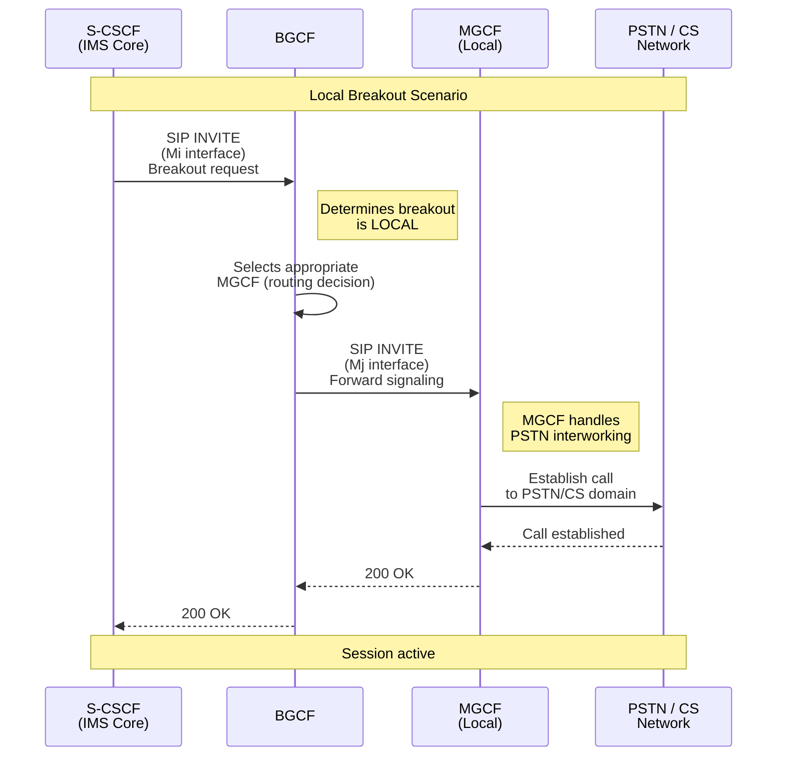
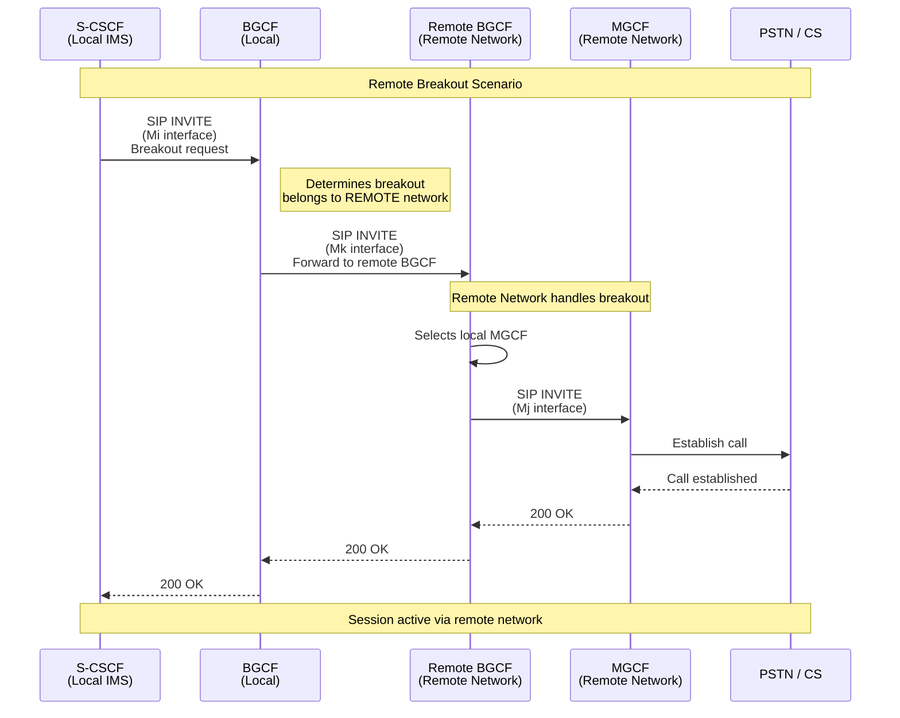
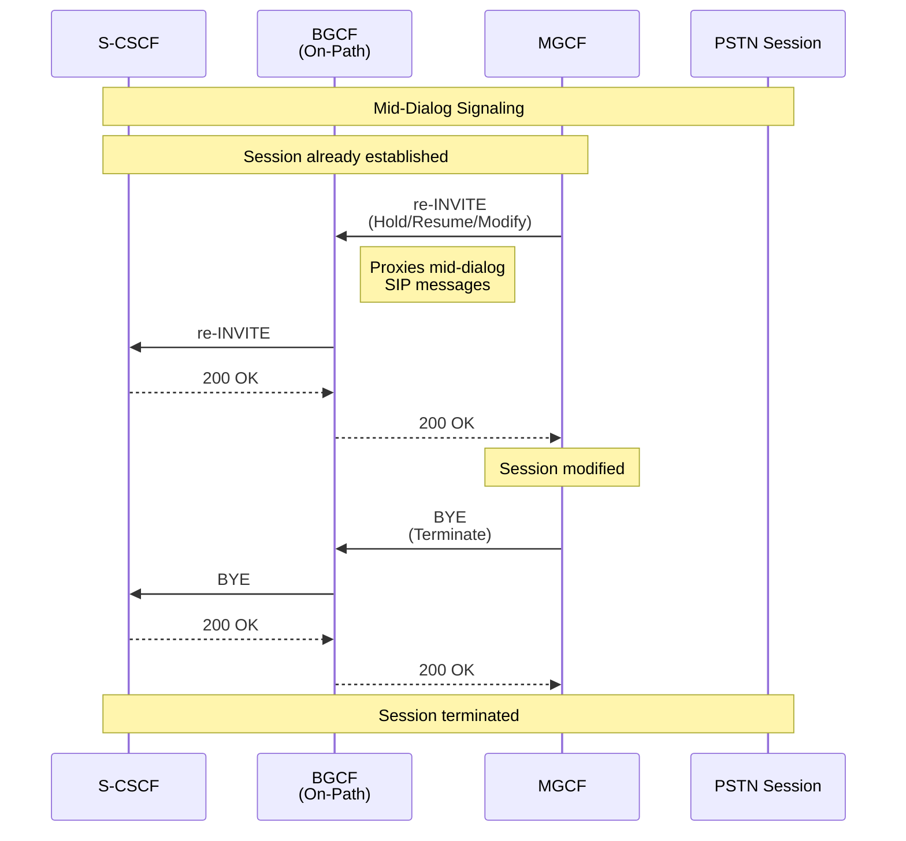
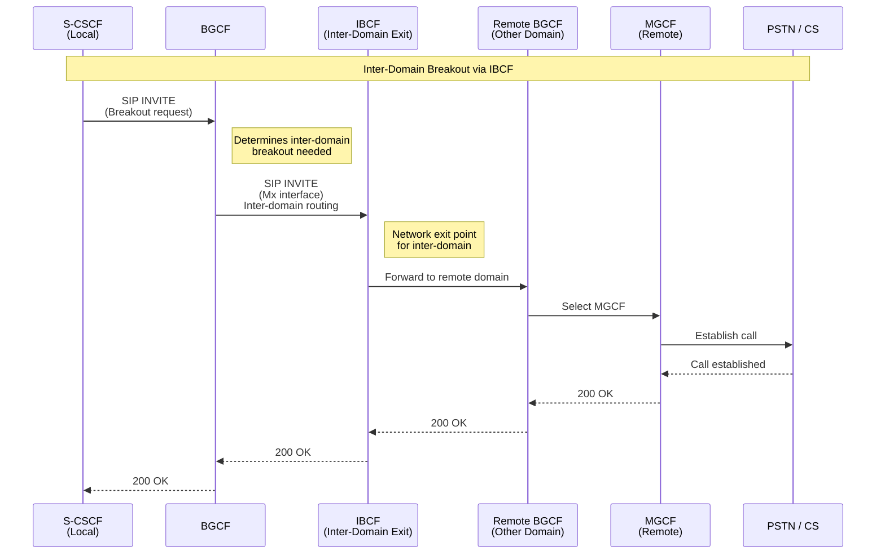

# BGCF Flow Diagrams

This document illustrates the key operational flows for the Breakout Gateway Control Function (BGCF) from its perspective within the IMS architecture.

## BGCF In One Line

**BGCF is a breakout decision engine.**

It:
- Decides *where* PSTN breakout happens
- Selects MGCF (local)
- Or forwards to remote BGCF
- Optionally stays in signaling path
- Generates charging records

## 1. Primary Flow – Local PSTN Breakout (Standard Case)

This is the most common scenario where BGCF determines that PSTN breakout should occur locally and selects an appropriate MGCF.

### Sequence Diagram



### What BGCF Does Here

- ✅ Receives INVITE from S-CSCF
- ✅ Determines breakout is local
- ✅ Selects appropriate MGCF
- ✅ Forwards signaling (Mj interface)
- ✅ Generates charging records

### Network View

```
[ IMS Core (Local Network) ]                    [ CS / PSTN Domain ]
         S-CSCF
           |
    (Mi - SIP INVITE)
           |
        | BGCF | ----> Selects LOCAL MGCF
           |
    (Mj - SIP toward MGCF)
           |
         MGCF -----> PSTN / CS Network
```

---

## 2. Remote Breakout (Mk - Forward to Remote BGCF)

When BGCF determines that breakout should occur in another network, it forwards the session to a remote BGCF.

### Sequence Diagram



### What BGCF Does Here

- ✅ Receives breakout request
- ✅ Determines breakout belongs to another network
- ✅ Forwards session to remote BGCF (Mk interface)
- ✅ Remote network handles MGCF selection
- ✅ Maintains charging correlation

### Network View

```
[ IMS Core (Local) ]                    [ Remote IMS Network ]
         S-CSCF
           |
    (Mi - SIP INVITE)
           |
        | BGCF | ---- (Mk) ----> Remote BGCF
                                         |
                                         |
                                      | MGCF |
                                         |
                                      | PSTN / CS |
```

---

## 3. On-Path Signaling Forwarding (Dialog Continuity)

When BGCF remains in the Route set, it proxies mid-dialog signaling between S-CSCF and MGCF.

### Sequence Diagram



### What BGCF Does Here

- ✅ Remains in Route set (if configured)
- ✅ Proxies mid-dialog SIP (re-INVITE, BYE, etc.)
- ✅ Does not manipulate media
- ✅ Maintains charging correlation
- ✅ Forwards requests and responses transparently

### Signaling Path

```
S-CSCF <----> BGCF <----> MGCF
  ^              |
  |              |
  +----- PSTN Session -----+
```

### Example Mid-Dialog Signaling

```
MGCF ---> BGCF ---> S-CSCF (re-INVITE / 200 OK / BYE)
```

---

## 4. Inter-Domain Exit Steering via IBCF

When sending toward another domain, BGCF may route via IBCF (Interconnection Border Control Function).

### Sequence Diagram



### What BGCF Does Here

- ✅ Determines inter-domain breakout required
- ✅ Routes via IBCF (Mx interface) for network exit
- ✅ IBCF handles inter-domain security/policy
- ✅ Remote domain handles breakout

---

## 5. Multi-Site IMS Deployment Topology

BGCF can operate in distributed deployments across multiple IMS sites.

### Topology Diagram

```mermaid
graph TB
    subgraph SiteA["IMS Site A"]
        P1[P-CSCF]
        S1[S-CSCF]
        M1[MGCF]
        B1[BGCF]
        I1[IBCF]
        I2[IBCF]
        
        P1 --> B1
        S1 --> B1
        M1 --> B1
        B1 --> I1
        B1 --> I2
        I1 --> PSTN[PSTN / CS]
        I2 --> PSTN
    end
    
    subgraph SiteB["IMS Site B (Central)"]
        P2[P-CSCF]
        S2[S-CSCF]
        M2[MGCF]
        B2[BGCF]
        I3[IBCF]
        I4[IBCF]
        
        P2 --> B2
        S2 --> B2
        M2 --> B2
        B2 --> I3
        B2 --> I4
        I3 --> PSTN
        I4 --> PSTN
    end
    
    subgraph SiteC["IMS Site C"]
        P3[P-CSCF]
        S3[S-CSCF]
        M3[MGCF]
        B3[BGCF]
        I5[IBCF]
        I6[IBCF]
        
        P3 --> B3
        S3 --> B3
        M3 --> B3
        B3 --> I5
        B3 --> I6
        I5 --> PSTN
        I6 --> PSTN
    end
    
    B1 -.->|BGCF to BGCF<br/>(Mk)| B2
    B2 -.->|BGCF to BGCF<br/>(Mk)| B3
    
    style B2 fill:#ff6b6b,stroke:#333,stroke-width:3px
    style SiteB fill:#fff3cd
```

### Key Points

- Each site has its own BGCF
- BGCFs communicate via Mk interface for remote breakout
- Central site (Site B) may handle more routing decisions
- Each site maintains local MGCF and IBCF for redundancy

---

## Interface Summary

| Interface | Direction | Purpose |
|-----------|-----------|---------|
| **Mi** | S-CSCF → BGCF | Breakout request from S-CSCF |
| **Mj** | BGCF → MGCF | Forward signaling to selected MGCF (local breakout) |
| **Mk** | BGCF → BGCF | Forward to remote BGCF (remote breakout) |
| **Mx** | BGCF → IBCF | Inter-domain exit routing |

---

## Related Documentation

- [BGCF Features List](../../components/coeur/bgcf/FEATURES_LIST.md)
- [ETSI TS 23.228](https://www.etsi.org/deliver/etsi_ts/123200_123299/123228/07.02.00_60/ts_123228v070200p.pdf) - IMS Stage 2
- [ETSI TS 29.163](https://www.etsi.org/deliver/etsi_ts/129100_129199/129163/16.04.00_60/ts_129163v160400p.pdf) - IMS-CS Interworking
