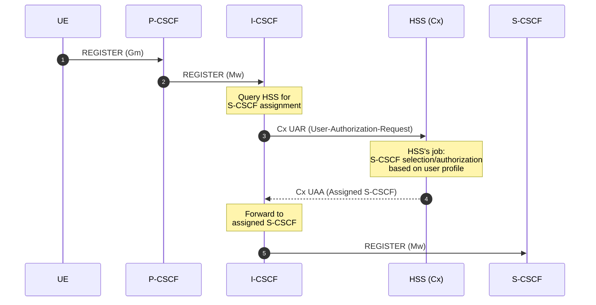
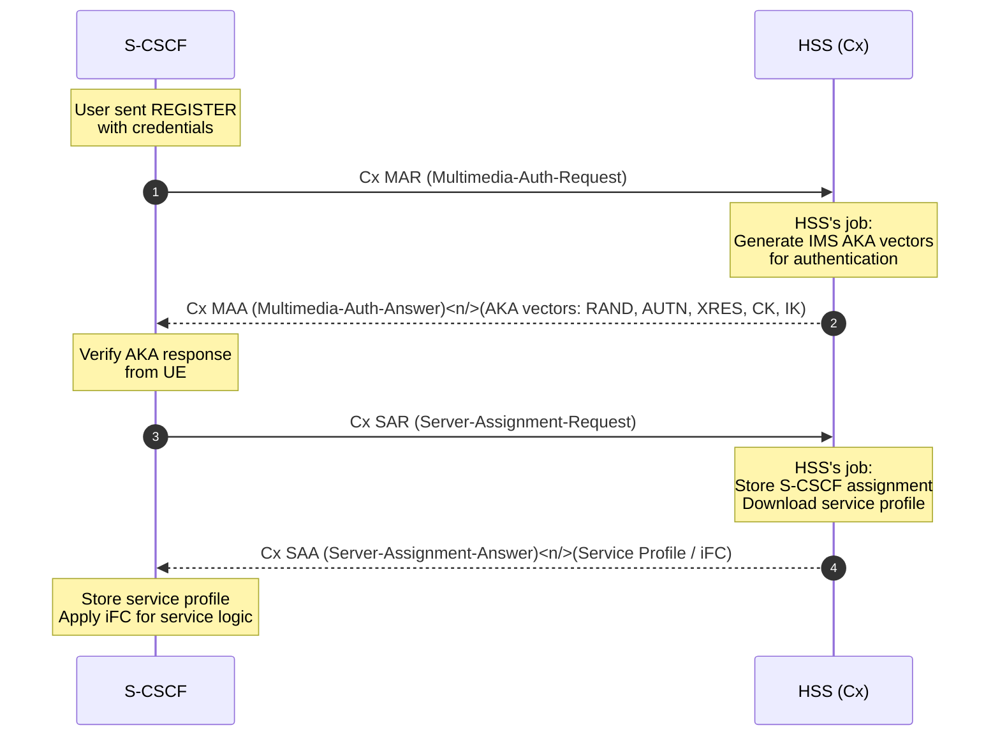
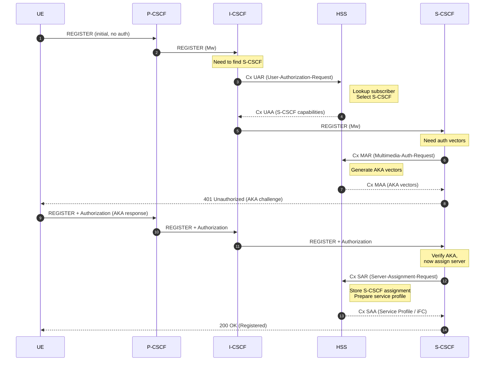
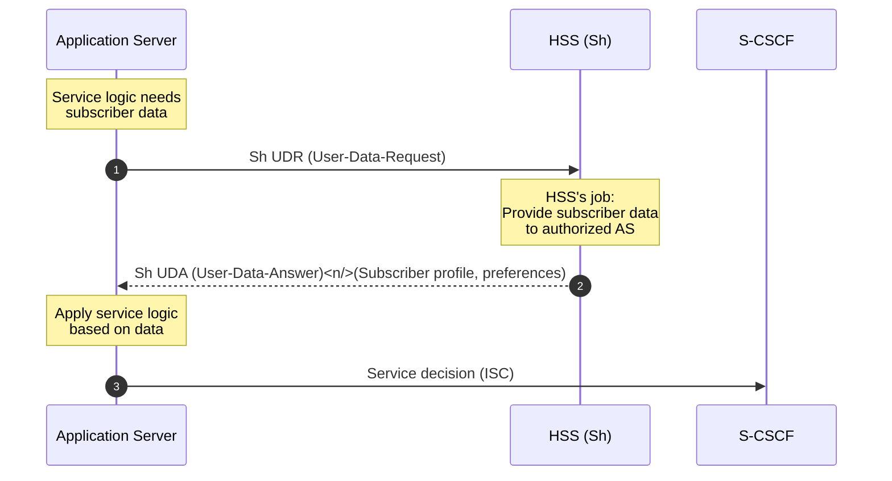
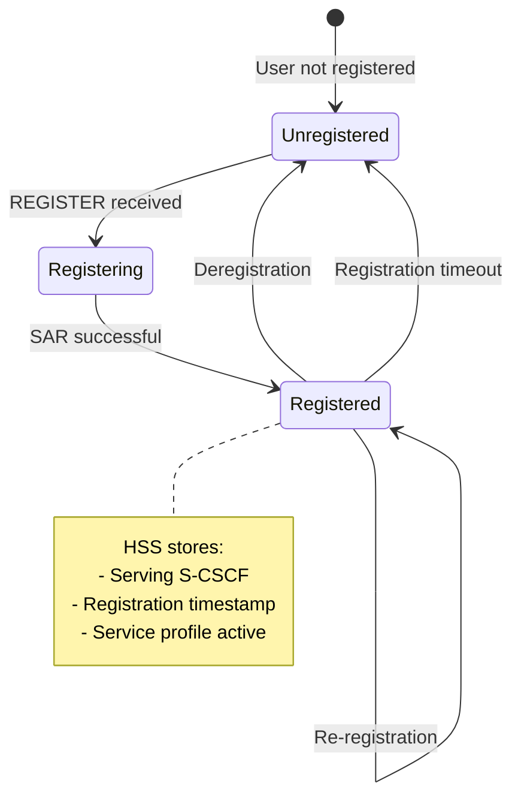
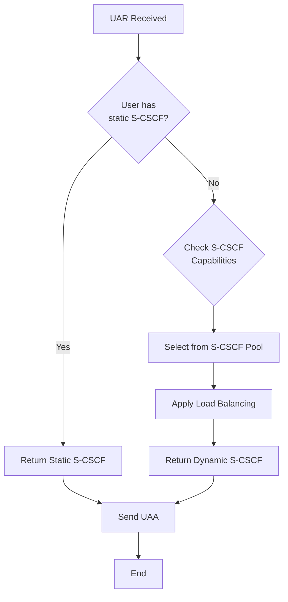
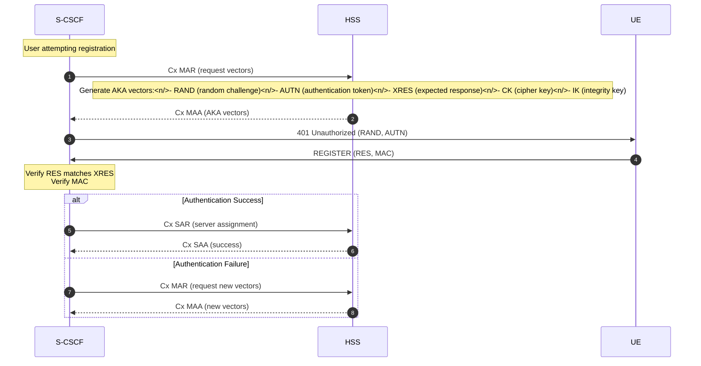

# HSS Flow Diagrams

This document illustrates the key operational flows for the Home Subscriber Server (HSS) from its perspective within the IMS architecture.

## HSS In One Line

**HSS is the IMS "source of truth" for subscriber identity, authentication vectors, and which S-CSCF + service profile applies.**

## 1. S-CSCF Assignment During REGISTER (I-CSCF ↔ HSS)

I-CSCF queries HSS to determine which S-CSCF should serve the user during registration.

### Sequence Diagram

### What HSS Does Here

- ✅ Receives UAR (User Authorization Request) from I-CSCF
- ✅ Looks up subscriber data (IMPI/IMPU)
- ✅ Determines S-CSCF assignment (static or dynamic selection)
- ✅ Returns UAA (User Authorization Answer) with S-CSCF capabilities
- ✅ Authorizes user for IMS service
- ✅ Provides S-CSCF selection criteria

---

## 2. Authentication Vectors + Service Profile Download (S-CSCF ↔ HSS)

S-CSCF requests authentication vectors and service profile from HSS during registration.

### Sequence Diagram

### What HSS Does Here

- ✅ Receives MAR (Multimedia Auth Request) from S-CSCF
- ✅ Generates IMS AKA authentication vectors (RAND, AUTN, XRES, CK, IK)
- ✅ Returns MAA (Multimedia Auth Answer) with vectors
- ✅ Receives SAR (Server Assignment Request) after successful authentication
- ✅ Stores S-CSCF assignment for user
- ✅ Downloads service profile including Initial Filter Criteria (iFC)
- ✅ Returns SAA (Server Assignment Answer) with complete service profile
- ✅ Updates registration state (user registered, serving S-CSCF)

---

## 3. Complete Registration Flow (HSS Perspective)

Full registration flow showing all HSS interactions.

### Sequence Diagram

### What HSS Does Here

- ✅ **UAR/UAA**: S-CSCF selection and authorization
- ✅ **MAR/MAA**: Authentication vector generation
- ✅ **SAR/SAA**: Server assignment and service profile delivery
- ✅ Maintains registration state
- ✅ Tracks serving S-CSCF for user

---

## 4. Service Profile Query (Sh Interface - Application Server)

Application Servers can query HSS for subscriber data via Sh interface.

### Sequence Diagram

### What HSS Does Here

- ✅ Receives UDR (User Data Request) from AS
- ✅ Validates AS authorization
- ✅ Retrieves subscriber data (profile, preferences, etc.)
- ✅ Returns UDA (User Data Answer) with requested data
- ✅ Supports subscription/notification model for data updates

---

## 5. Registration State Management

HSS tracks which S-CSCF is serving each user and their registration status.

### State Diagram

### What HSS Does Here

- ✅ Tracks registration state (registered/unregistered)
- ✅ Stores serving S-CSCF reference
- ✅ Updates state on SAR (Server Assignment Request)
- ✅ Updates state on deregistration
- ✅ Provides state to I-CSCF for routing decisions

---

## 6. S-CSCF Assignment Policies

HSS implements S-CSCF assignment logic based on subscriber profile and network policies.

### Assignment Flow

### What HSS Does Here

- ✅ Checks for static S-CSCF assignment
- ✅ Evaluates S-CSCF capabilities if dynamic
- ✅ Applies load balancing across S-CSCF pool
- ✅ Returns appropriate S-CSCF in UAA
- ✅ Maintains assignment consistency

---

## 7. Authentication Vector Lifecycle

HSS generates and manages IMS AKA authentication vectors.

### Vector Generation Flow

### What HSS Does Here

- ✅ Generates cryptographically secure AKA vectors
- ✅ Uses subscriber's K key (shared secret)
- ✅ Provides vectors for authentication challenge
- ✅ Supports vector regeneration on failure
- ✅ Manages vector lifecycle and expiration

---

## Interface Summary

| Interface | Direction | Purpose | Key Messages |
|-----------|-----------|---------|--------------|
| **Cx** | I-CSCF/S-CSCF ↔ HSS | S-CSCF assignment, auth vectors, service profile | UAR/UAA, MAR/MAA, SAR/SAA |
| **Sh** | AS ↔ HSS | Service/subscriber data access | UDR/UDA, SNR/SNA |

## Key Diameter Messages (Cx Interface)

| Message | Direction | Purpose |
|---------|-----------|---------|
| **UAR** (User-Authorization-Request) | I-CSCF → HSS | Query for S-CSCF assignment |
| **UAA** (User-Authorization-Answer) | HSS → I-CSCF | Return S-CSCF capabilities |
| **MAR** (Multimedia-Auth-Request) | S-CSCF → HSS | Request authentication vectors |
| **MAA** (Multimedia-Auth-Answer) | HSS → S-CSCF | Return AKA vectors |
| **SAR** (Server-Assignment-Request) | S-CSCF → HSS | Assign S-CSCF, request service profile |
| **SAA** (Server-Assignment-Answer) | HSS → S-CSCF | Return service profile (iFC) |

---

## Related Documentation

- [HSS Features List](../../components/coeur/hss/FEATURES_LIST.md)
- [ETSI TS 23.228](https://www.etsi.org/deliver/etsi_ts/123200_123299/123228/07.02.00_60/ts_123228v070200p.pdf) - IMS Stage 2
- [ETSI TS 29.228](https://www.etsi.org/deliver/etsi_ts/129200_129299/129228/) - Cx and Dx interfaces
- [ETSI TS 29.329](https://www.etsi.org/deliver/etsi_ts/129300_129399/129329/) - Sh interface
