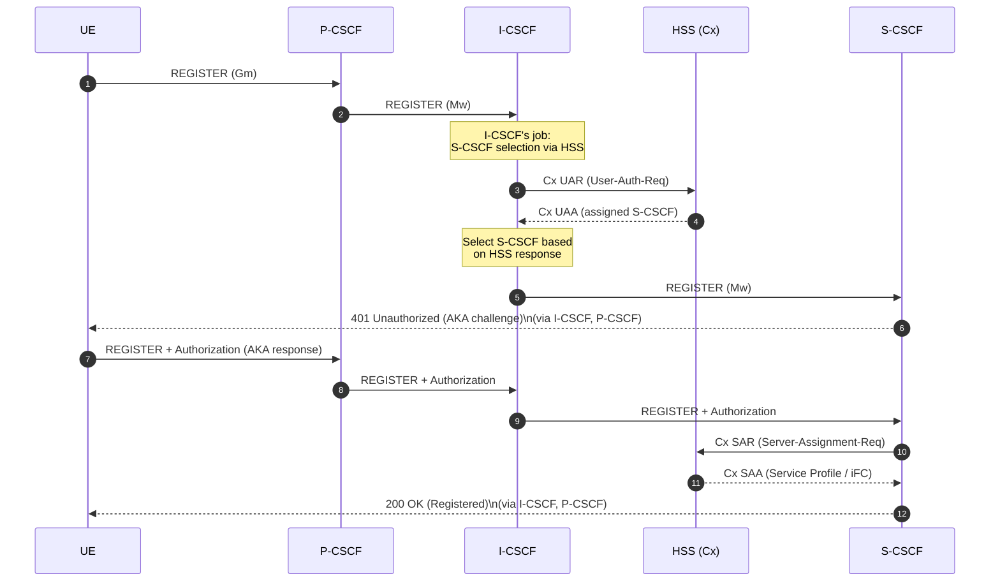
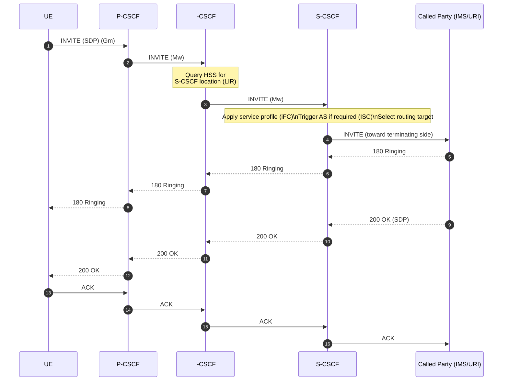

# I-CSCF Flow Diagrams

This document illustrates the key operational flows for the Interrogating Call Session Control Function (I-CSCF) from its perspective within the IMS architecture.

## I-CSCF In One Line

**I-CSCF decides which S-CSCF handles a user and shields internal IMS structure.**

## 1. Registration Flow (S-CSCF Selection)

I-CSCF's primary role is to query HSS and select the appropriate S-CSCF for user registration.

### Sequence Diagram



### What I-CSCF Does Here

- ✅ Receives REGISTER from P-CSCF (Mw)
- ✅ Queries HSS via Cx interface (UAR)
- ✅ Receives S-CSCF assignment from HSS (UAA)
- ✅ Selects appropriate S-CSCF
- ✅ Forwards REGISTER to selected S-CSCF
- ✅ Provides topology hiding (hides internal S-CSCF structure)

### Key Diameter Messages

- **UAR (User Authorization Request)**: Query HSS for S-CSCF assignment
- **UAA (User Authorization Answer)**: HSS response with S-CSCF capabilities
- **LIR/LIA (Location Info Request/Answer)**: For session routing (not shown in registration)

---

## 2. Session Flow (INVITE Routing)

I-CSCF routes incoming INVITE requests to the appropriate S-CSCF.

### Sequence Diagram



### What I-CSCF Does Here

- ✅ Receives INVITE from P-CSCF (Mw)
- ✅ Queries HSS for S-CSCF location (LIR/LIA)
- ✅ Routes INVITE to appropriate S-CSCF
- ✅ Proxies responses (180, 200 OK, ACK)
- ✅ Maintains topology hiding

---

## 3. Topology Hiding

I-CSCF hides internal IMS structure from external domains.

### Network View

```
[ External Domain / P-CSCF ]
         |
    (Mw - SIP)
         |
      | I-CSCF |
         |
    (Topology Hidden)
         |
    [ Internal S-CSCF Pool ]
    (Structure not exposed)
```

### What I-CSCF Does Here

- ✅ Receives SIP from external domains
- ✅ Manipulates headers to hide internal structure
- ✅ Routes to internal S-CSCF without exposing topology
- ✅ Prevents external domains from learning S-CSCF addresses

---

## Interface Summary

| Interface | Direction | Purpose |
|-----------|-----------|---------|
| **Mw** | P-CSCF ↔ I-CSCF ↔ S-CSCF | SIP signaling routing |
| **Cx** | I-CSCF ↔ HSS | S-CSCF selection queries (Diameter) |

---

## Related Documentation

- [I-CSCF Features List](../../components/coeur/icscf/FEATURES_LIST.md)
- [ETSI TS 23.228](https://www.etsi.org/deliver/etsi_ts/123200_123299/123228/07.02.00_60/ts_123228v070200p.pdf) - IMS Stage 2
- [ETSI TS 29.228](https://www.etsi.org/deliver/etsi_ts/129200_129299/129228/) - Cx and Dx interfaces
