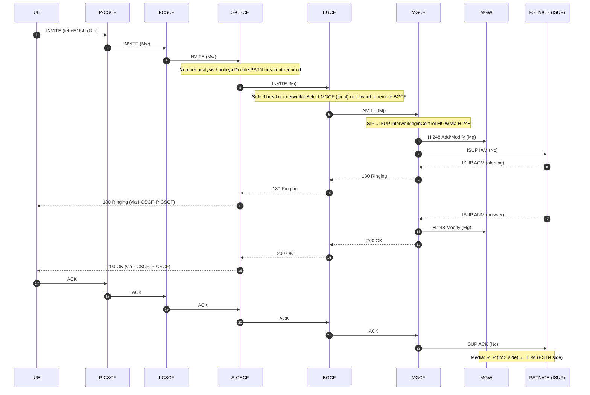
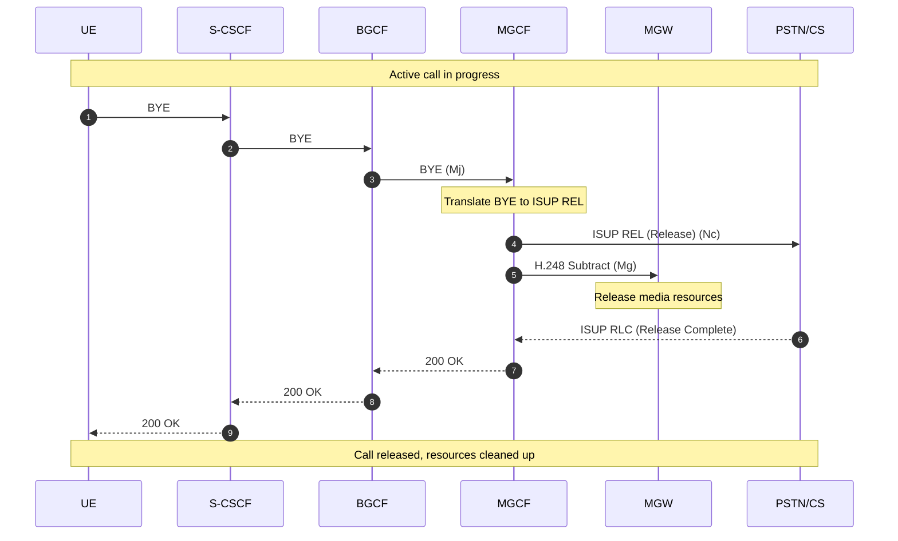
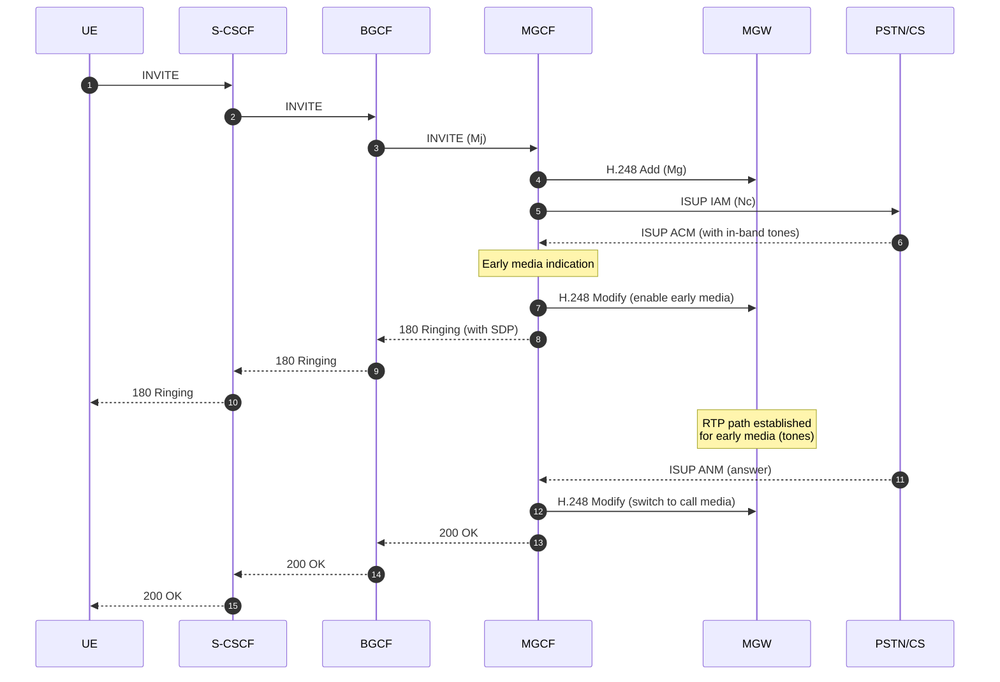
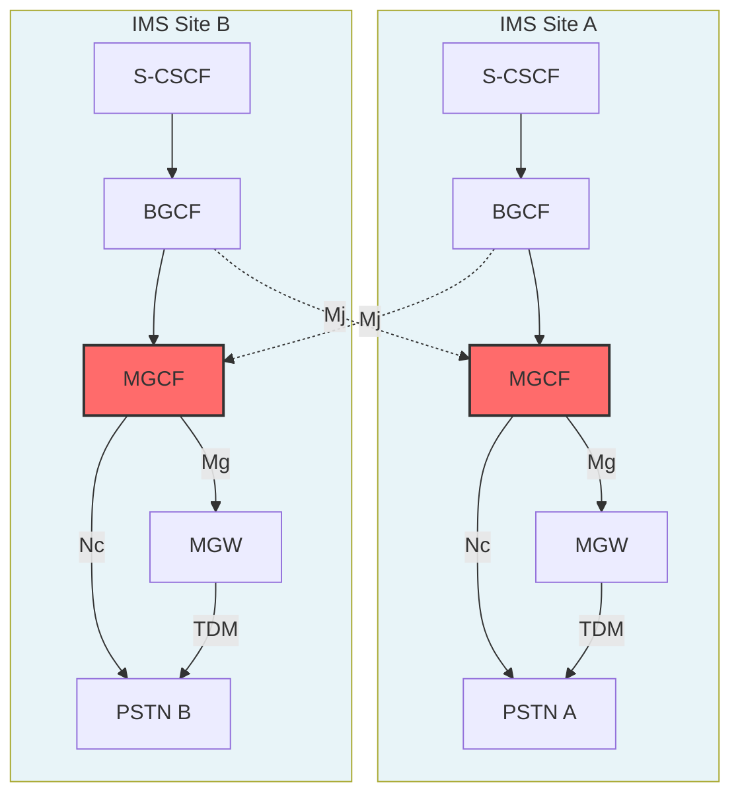
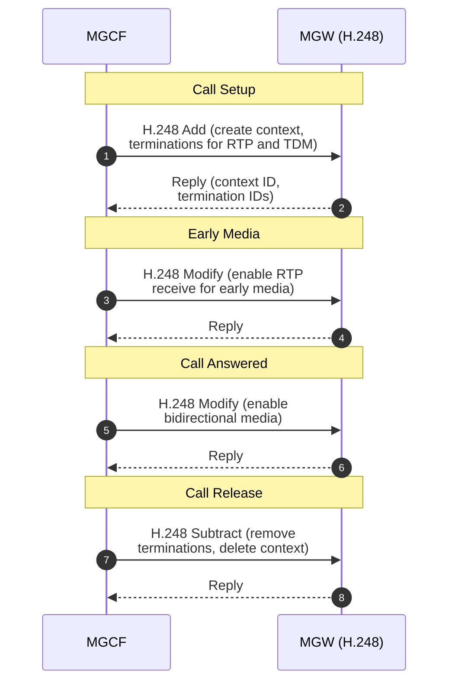

# MGCF Flow Diagrams

This document illustrates the key operational flows for the Media Gateway Control Function (MGCF) from its perspective within the IMS architecture.

## MGCF In One Line

**MGCF translates IMS SIP signaling into legacy circuit signaling and controls the Media Gateway that carries the actual RTP↔TDM media.**

## 1. High-Level Breakout Interworking View

MGCF serves as the signaling interworking point between IMS and PSTN/CS domains.

### Network View

```
[ IMS Core ]
     |
(Mj - SIP)
     |
  | MGCF |
     |
(Mg - H.248)
     |
  | MGW |
     |
(TDM / SS7 / ISUP)
     |
[ PSTN / CS Domain ]
```

### Key Separation

- ✅ **MGCF = signaling**
- ✅ **MGW = media**
- ✅ **MGCF does not touch RTP packets directly**

---

## 2. Detailed Signaling Flow (Outgoing PSTN Call)

Complete flow showing SIP to ISUP interworking and MGW control.

### Sequence Diagram



### Message Mapping

| SIP Message | ISUP Message | Context |
|-------------|--------------|---------|
| INVITE | IAM (Initial Address Message) | Call setup |
| 180 Ringing | ACM (Address Complete Message) | Alerting |
| 200 OK | ANM (Answer Message) | Call answered |
| BYE | REL (Release) | Call release |
| 200 OK (to BYE) | RLC (Release Complete) | Release complete |

### What MGCF Does Here

- ✅ Receives SIP INVITE from BGCF (Mj interface)
- ✅ Translates SIP to ISUP IAM
- ✅ Controls MGW via H.248 (Mg interface)
- ✅ Sends IAM to PSTN (Nc interface)
- ✅ Translates ISUP responses to SIP
- ✅ Maps cause codes (Q.850 ↔ SIP)
- ✅ Handles timer management

---

## 3. Call Release Flow

MGCF handles call teardown and resource cleanup.

### Sequence Diagram



### What MGCF Does Here

- ✅ Receives BYE from BGCF
- ✅ Translates BYE to ISUP REL
- ✅ Commands MGW to release resources (H.248 Subtract)
- ✅ Receives RLC from PSTN
- ✅ Translates RLC to 200 OK
- ✅ Completes call teardown

---

## 4. Cause Code Mapping

MGCF maps between SIP response codes and ISUP cause codes.

### Mapping Table

| SIP Response | ISUP Cause Code | Description |
|--------------|----------------|-------------|
| 200 OK | Normal | Call successful |
| 404 Not Found | 1 (Unallocated number) | Number not found |
| 486 Busy Here | 17 (User busy) | User busy |
| 480 Temporarily Unavailable | 18 (No user responding) | No answer |
| 503 Service Unavailable | 34 (No circuit available) | Network congestion |
| 500 Server Error | 41 (Temporary failure) | Network error |

### What MGCF Does Here

- ✅ Receives ISUP cause codes from PSTN
- ✅ Maps to appropriate SIP response codes
- ✅ Receives SIP error responses from IMS
- ✅ Maps to appropriate ISUP cause codes
- ✅ Ensures proper error handling across domains

---

## 5. Early Media Handling

MGCF coordinates early media (ringing tones, announcements) between domains.

### Sequence Diagram



### What MGCF Does Here

- ✅ Receives ACM with early media indication
- ✅ Commands MGW to enable early media path
- ✅ Includes SDP in 180 Ringing for RTP setup
- ✅ Coordinates media switching on answer
- ✅ Handles in-band tones and announcements

---

## 6. Multi-Site IMS Deployment (MGCF Focus)

MGCFs are deployed near TDM trunks, with each site having its own MGCF/MGW pair.

### Topology Diagram



### Important Notes

- ✅ **MGCFs are often geographically deployed near TDM trunks**
- ✅ **Each site usually has its own MGCF/MGW pair**
- ✅ **BGCF decides which MGCF site handles breakout**

---

## 7. H.248 Control of Media Gateway

MGCF controls MGW resources via H.248 (Megaco) protocol.

### H.248 Commands

| Command | Purpose | Context |
|---------|---------|---------|
| Add | Create new media connection | Call setup |
| Modify | Change media parameters | Media modification, early media |
| Subtract | Remove media connection | Call release |
| Move | Transfer connection | Call transfer scenarios |

### Sequence Example



### What MGCF Does Here

- ✅ Creates MGW contexts for calls
- ✅ Adds terminations for RTP and TDM sides
- ✅ Modifies media parameters during call
- ✅ Subtracts terminations on call release
- ✅ Manages MGW resource lifecycle

---

## Interface Summary

| Interface | Direction | Purpose |
|-----------|-----------|---------|
| **Mj** | BGCF/S-CSCF → MGCF | SIP signaling from IMS |
| **Mg** | MGCF ↔ MGW | H.248 control of media gateway |
| **Nc** | MGCF ↔ PSTN | ISUP/BICC signaling |

---

## What MGCF Does NOT Do

- ❌ Does **not** perform SIP service logic
- ❌ Does **not** select breakout (BGCF does that)
- ❌ Does **not** authenticate subscribers
- ❌ Does **not** anchor RTP directly (MGW does)
- ❌ Does **not** enforce IMS policy (P-CSCF does that)

---

## Related Documentation

- [MGCF Features List](../../components/coeur/mgcf/FEATURES_LIST.md)
- [ETSI TS 23.228](https://www.etsi.org/deliver/etsi_ts/123200_123299/123228/07.02.00_60/ts_123228v070200p.pdf) - IMS Stage 2
- [ETSI TS 29.163](https://www.etsi.org/deliver/etsi_ts/129100_129199/129163/16.04.00_60/ts_129163v160400p.pdf) - IMS-CS Interworking
