```mermaid
sequenceDiagram
    participant UE as UE<br/>(Emergency)
    participant PCSCF as P-CSCF
    participant ECSCF as E-CSCF<br/>(Emergency)
    participant LRF as LRF<br/>(Location)
    participant PSAP as PSAP<br/>(Public Safety)

    Note over UE,PSAP: Emergency Call Flow

    UE->>PCSCF: INVITE<br/>(Gm - emergency indication)
    Note right of PCSCF: Detect emergency call<br/>Priority routing
    
    PCSCF->>ECSCF: INVITE<br/>(emergency routing)
    Note right of ECSCF: Emergency handling
    
    ECSCF->>LRF: Query location<br/>(for routing)
    LRF-->>ECSCF: Location + PSAP info
    
    ECSCF->>PSAP: INVITE<br/>(emergency call)
    
    PSAP-->>ECSCF: 200 OK
    ECSCF-->>PCSCF: 200 OK
    PCSCF-->>UE: 200 OK<br/>(Gm)
    
    Note over UE,PSAP: Emergency call established
```

# P-CSCF Flow Diagrams

This document illustrates the key operational flows for the Proxy Call Session Control Function (P-CSCF) from its perspective within the IMS architecture.

## P-CSCF In One Line

**P-CSCF secures and anchors UE SIP signaling into the IMS core.**

## 1. High-Level Access Edge View

P-CSCF serves as the first SIP contact point for User Equipment, providing security and policy enforcement at the IMS access edge.

### Network View

```
[ UE / Access Network ]
         |
    (Gm - SIP over IPSec/TLS)
         |
      | P-CSCF |
         |
    (Mw - SIP)
         |
  I-CSCF / S-CSCF
         |
    [ IMS Core ]
```

### What P-CSCF Does Here

- ✅ Terminates secure SIP from UE (Gm interface)
- ✅ Validates and forwards SIP messages
- ✅ Inserts Record-Route to maintain signaling path
- ✅ Triggers policy control (PCRF/PCF)
- ✅ Maintains dialog anchoring

### Sequence Diagram


---

## 2. Primary Flow – SIP REGISTER with Security Exchange

This is the standard registration flow where P-CSCF establishes security association with UE.

### Sequence Diagram


### What P-CSCF Does Here

- ✅ Receives initial REGISTER from UE (Gm)
- ✅ Forwards to I-CSCF (Mw)
- ✅ Handles 401 Unauthorized response
- ✅ Establishes IPSec Security Association
- ✅ Enforces integrity protection
- ✅ Maintains Record-Route for dialog anchoring

---

## 3. Primary Flow – SIP INVITE (Call Setup)

P-CSCF forwards call setup requests and maintains dialog state.

### Sequence Diagram


### What P-CSCF Does Here

- ✅ Receives INVITE from UE (Gm)
- ✅ Validates SIP headers (From/To/Contact)
- ✅ Triggers policy control (QoS authorization)
- ✅ Inserts Record-Route header
- ✅ Forwards to S-CSCF (Mw)
- ✅ Proxies all subsequent messages (180, 200 OK, ACK)
- ✅ Maintains dialog state for mid-dialog signaling

---

## 4. Emergency Call Handling

P-CSCF routes emergency calls to E-CSCF (Emergency CSCF) instead of normal I-CSCF.

### Sequence Diagram



### What P-CSCF Does Here

- ✅ Detects emergency call indication
- ✅ Routes to E-CSCF (not I-CSCF)
- ✅ Bypasses normal registration checks
- ✅ Maintains security (IPSec still required)
- ✅ Supports emergency registration if needed

---

## 5. Policy Control Interaction (Rx Interface)

P-CSCF interacts with PCRF/PCF for QoS and policy enforcement.

### Sequence Diagram


### What P-CSCF Does Here

- ✅ Extracts media information from SDP
- ✅ Requests QoS authorization from PCRF/PCF (Rx)
- ✅ Receives policy decisions
- ✅ Updates policy on media changes
- ✅ Maintains policy session state

---

## 6. Multi-Site IMS Deployment (P-CSCF Focus)

P-CSCF is deployed close to access networks, with each site having its own P-CSCF pool.

### Topology Diagram


### Key Observations

- ✅ **P-CSCF is always deployed close to access edge**
- ✅ **Each site typically has its own P-CSCF pool**
- ✅ **UE attaches to geographically nearest P-CSCF**
- ✅ **Inter-site signaling does NOT traverse P-CSCF ↔ P-CSCF**
- ✅ **P-CSCF is access-bound, not inter-domain routing logic**

### What P-CSCF Does NOT Do

- ❌ Does **not** perform service logic
- ❌ Does **not** select breakout
- ❌ Does **not** anchor media (that's SBC/IMS-ALG/IMS-ATCF domain)
- ❌ Does **not** perform HSS subscriber selection
- ❌ Does **not** manage inter-IMS routing

---

## 7. NAT Traversal Support

P-CSCF helps maintain SIP signaling through NATs using keep-alives and STUN.

### Sequence Diagram


### What P-CSCF Does Here

- ✅ Receives SIP through NAT
- ✅ Responds to keep-alive messages (CRLF)
- ✅ Supports STUN binding requests
- ✅ Maintains NAT bindings via periodic keep-alives
- ✅ Enables SIP OPTIONS for NAT traversal

---

## Interface Summary

| Interface | Direction | Purpose |
|-----------|-----------|---------|
| **Gm** | UE ↔ P-CSCF | Secure SIP signaling (IPSec/TLS) |
| **Mw** | P-CSCF ↔ I-CSCF/S-CSCF | Forward SIP to IMS core |
| **Rx** | P-CSCF ↔ PCRF/PCF | Policy control and QoS authorization |

---

## Related Documentation

- [P-CSCF Features List](../../components/coeur/pcscf/FEATURES_LIST.md)
- [ETSI TS 23.228](https://www.etsi.org/deliver/etsi_ts/123200_123299/123228/07.02.00_60/ts_123228v070200p.pdf) - IMS Stage 2
- [ETSI TS 24.229](https://www.etsi.org/deliver/etsi_ts/124200_124299/124229/16.04.00_60/ts_124229v160400p.pdf) - SIP/SDP Protocol
