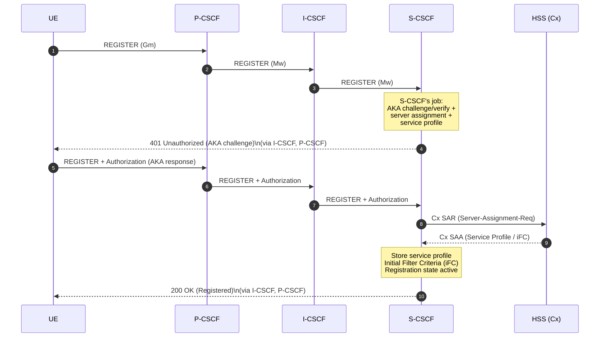
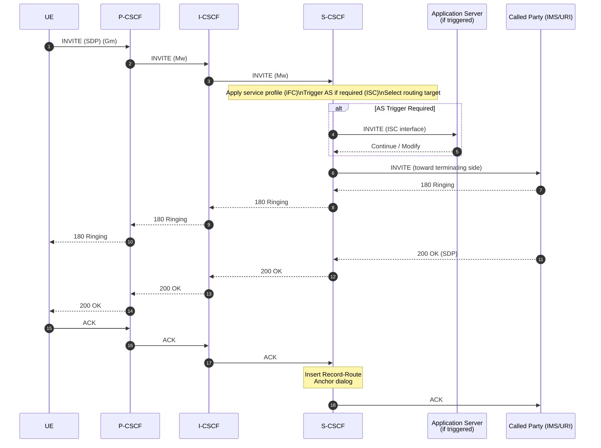
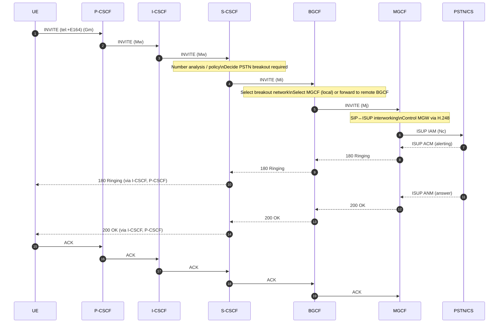
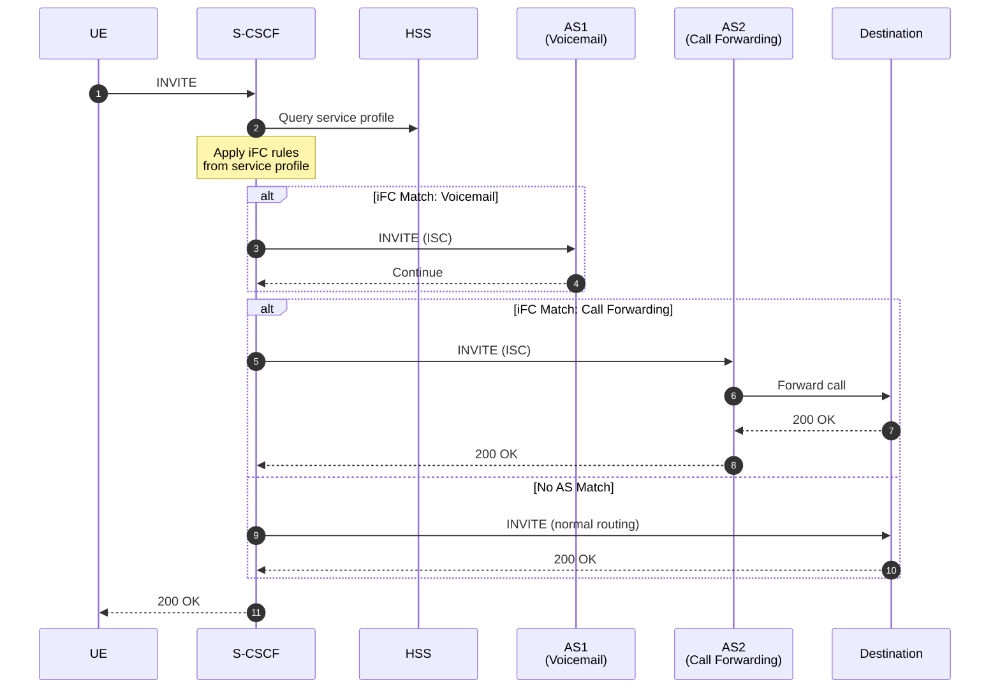
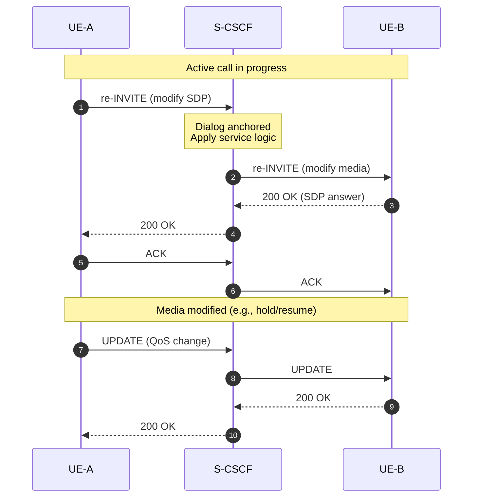

# S-CSCF Flow Diagrams

This document illustrates the key operational flows for the Serving Call Session Control Function (S-CSCF) from its perspective within the IMS architecture.

## S-CSCF In One Line

**S-CSCF is the stateful SIP service brain of the IMS domain.**

## 1. Registration Flow (Core Logic)

S-CSCF handles user authentication, service profile download, and registration state management.

### Sequence Diagram

### What S-CSCF Does Here

- ✅ Receives REGISTER from I-CSCF
- ✅ Issues 401 Unauthorized (AKA challenge)
- ✅ Verifies AKA authentication response
- ✅ Performs server assignment (SAR to HSS)
- ✅ Downloads service profile and iFC from HSS
- ✅ Maintains registration state
- ✅ Returns 200 OK upon successful registration

---

## 2. Basic Session Flow (Outgoing Call)

S-CSCF applies service logic, triggers Application Servers, and determines routing.

### Sequence Diagram

### What S-CSCF Does Here

- ✅ Receives INVITE from I-CSCF
- ✅ Applies Initial Filter Criteria (iFC) from service profile
- ✅ Triggers Application Servers if required (ISC interface)
- ✅ Determines routing target (IMS, PSTN, etc.)
- ✅ Inserts Record-Route to anchor dialog
- ✅ Proxies all subsequent messages
- ✅ Maintains dialog state

---

## 3. PSTN Breakout Decision

S-CSCF analyzes destination and triggers BGCF for PSTN breakout.

### Sequence Diagram

### What S-CSCF Does Here

- ✅ Receives INVITE with tel: URI
- ✅ Performs number analysis (ENUM, routing logic)
- ✅ Determines PSTN breakout required
- ✅ Routes to BGCF (Mi interface)
- ✅ Maintains dialog anchoring
- ✅ Proxies responses and ACK

---

## 4. Application Server Triggering (ISC Interface)

S-CSCF triggers Application Servers based on Initial Filter Criteria.

### Sequence Diagram

### What S-CSCF Does Here

- ✅ Evaluates Initial Filter Criteria (iFC) from service profile
- ✅ Triggers Application Servers based on iFC matches
- ✅ Handles AS responses (Continue, Terminate, etc.)
- ✅ Applies service logic in correct order
- ✅ Maintains service execution state

---

## 5. Mid-Dialog Request Handling

S-CSCF handles mid-dialog requests like re-INVITE and UPDATE.

### Sequence Diagram

### What S-CSCF Does Here

- ✅ Receives mid-dialog requests (re-INVITE, UPDATE)
- ✅ Validates dialog state
- ✅ Applies service logic if required
- ✅ Forwards to other dialog participant
- ✅ Maintains dialog continuity

---

## Interface Summary

| Interface | Direction | Purpose |
|-----------|-----------|---------|
| **Mw** | I-CSCF ↔ S-CSCF | SIP signaling routing |
| **Cx** | S-CSCF ↔ HSS | Registration, authentication, service profile (Diameter) |
| **ISC** | S-CSCF ↔ AS | Application Server triggering |
| **Mi** | S-CSCF → BGCF | PSTN breakout routing |
| **Ro/Rf** | S-CSCF ↔ CCF/OCF | Charging events (Diameter) |

---

## Related Documentation

- [S-CSCF Features List](../../components/coeur/scscf/FEATURES_LIST.md)
- [ETSI TS 23.228](https://www.etsi.org/deliver/etsi_ts/123200_123299/123228/07.02.00_60/ts_123228v070200p.pdf) - IMS Stage 2
- [ETSI TS 29.228](https://www.etsi.org/deliver/etsi_ts/129200_129299/129228/) - Cx and Dx interfaces
